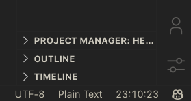

    
    <h1 align="center">VS Code Current Time Status Bar</h1>

这个简单的VS Code扩展将在状态栏显示当前的时间，并且每秒自动更新。

## Features

实时显示当前时间在VS Code的状态栏。

每秒自动更新，确保时间始终准确。

## 如何使用

1.安装并启用此扩展。
2.打开或重新加载VS Code，你将在右下角的状态栏看到当前的时间。
3.无需其他配置，它将自动更新时间。

## 问题与建议

如果你遇到任何问题或有任何建议，请在GitHub仓库中提交一个issue。

## 贡献

欢迎提交pull request以改进此扩展。

## 许可
此项目采用MIT许可证。

## 预览

**Enjoy!**
